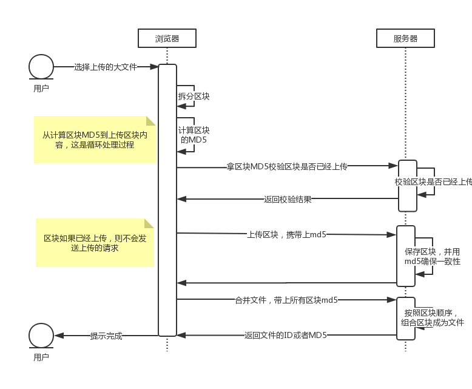

# send-big-file

分片发送大文件。

## 特性

- 支持分片并发上传
- 失败自动重试
- 断点续传

## 快速安装

```shell
yarn add send-big-file
```

或者

```shell
npm i --save send-big-file
```

## 快速使用

```typescript
import sendBigFile, { UploadFileStat } from 'send-big-file';

// 定义文件
const file: File = ...;
// 上传状态
const uploadFileStat: UploadFileStat | undefined;
sendBigFile(file).subscribe(
  (stat) => {
    uploadFileStat = stat;
    console.log(`上传进度: ${((stat.loaded / stat.total) * 100).toFixed(2)}%`);
  },
  (error) => {
    console.log('上传失败');
  },
  () => {
    console.log(uploadFileStat.success ? '上传成功' : '上传失败');
  },
);
```

提供了与[React 结合的例子](examples/react)。

## 方法签名

```typescript
sendBigFile(file: File, options?: Options): Observable<UploadFileStat>;
```

### 参数说明

- `file` 要上传的文件
- `options` 上传配置，主要包括：

  - `concurrent` 并发数目，默认为 10

  - `chunkSize` 分片大小，以 b 为单位，默认为 2MB

  - `chunkExists` 检查分片是否已经上传的方法

    默认实现：

    ```typescript
    import { from, Observable } from "rxjs";
    import http from "@sinoui/http";
    import { map } from "rxjs/operators";

    /**
     * 判断分片是否已经上传
     *
     * @param md5 分片md5
     */
    function chunkExists(md5: string): Observable<boolean> {
      return from(
        http.get<{ exists: boolean }>(`/api/big-file/chunk/${md5}/status`)
      ).pipe(map(result => result.exists));
    }
    ```

    上述示例中：

    - 默认接收一个 md5 参数，表示分片的 md5 值
    - 函数必须返回一个[Observable](https://rxjs.dev/guide/observable)形式的布尔值

  - `sendChunk` 上传分片的方法

    默认实现：

    ```typescript
    import sendFile from "@sinoui/http-send-file";
    import { Observable } from "rxjs";

    /**
     * 上传分片
     *
     * @param blob 分片内容
     * @param md5 分片的md5
     */
    function sendChunk(blob: Blob, md5: string) {
      return new Observable<ProgressEvent>(observer => {
        sendFile(`/api/big-file/chunk/${md5}`, blob, "file", {
          onUploadProgress: event => observer.next(event)
        })
          .then(() => {
            observer.complete();
          })
          .catch(error => {
            observer.error(error);
          });
      });
    }
    ```

    上述示例中：

    - 接收两个参数，其中`file`表示分片文件，`md5`表示分片文件对应的 md5
    - 返回一个 promise

  - `mergeChunks` 合并分片的方法

    默认实现：

    ```typescript
    import { Observable } from "rxjs";
    import http from "@sinoui/http";

    /**
     * 合并分片，形成文件
     *
     * @param {File} file 文件
     * @param {string[]} chunks 文件的所有分片md5
     * @returns {Observable<string>}
     */
    function mergeChunks(file: File, chunks: string[]): Observable<string> {
      return new Observable<string>(observer => {
        http.post<{ fileId: string }>(`/api/big-file/merge`, chunks).then(
          result => {
            observer.next(result.fileId);
            observer.complete();
          },
          error => observer.error(error)
        );
      });
    }
    ```

    上述示例：

    - 接收两个参数，`file`表示整个文件，`chunks`表示文件所有的分片 md5
    - 返回一个字符串，表示文件 id

### 返回值说明

`sendBigFile()`返回的是`Observable<UploadFileStat>`，表示文件上传进度和完成情况。

`UploadFileStat`有以下属性：

```typescript
/**
 * 文件上传状态
 */
interface FileUploadStat {
  /**
   * 文件id，这是文件完成时后端返回的文件id
   */
  fileId?: string;

  /**
   * 是否结束完成
   */
  completed: boolean;

  /**
   * 上传失败。
   *
   * @type {boolean}
   * @memberof FileUploadStat
   */
  error: boolean;

  /**
   * 是否上传成功
   *
   * @type {boolean}
   * @memberof FileUploadStat
   */
  success: boolean;

  /**
   * 总大小
   */
  total: number;

  /**
   * 已上传大小
   */
  loaded: number;

  /**
   * 所有准备好MD5的分片
   */
  chunks: string[];

  /**
   * 开始时间
   *
   * @type {number}
   * @memberof FileUploadStat
   */
  beginTime: number;

  /**
   * 结束时间
   *
   * @type {number}
   * @memberof FileUploadStat
   */
  endTime: number;
}
```

使用情况如下：

```typescript
import sendBigFile, { UploadFileStat } from "send-big-file";

let uploadFileStat: UploadFileStat | undefined;
const subscription = sendBigFile(file).subscribe(
  (stat: UploadFileStat) => {
    uploadFileStat = stat;

    const progress = ((stat.loaded / stat.total) * 100).toFixed(2);
    console.log(`上传进度: ${progress}%`);
  },
  undefined,
  () => {
    if (uploadFileStat.success) {
      console.log("上传成功");
    }
    if (uploadFileStat.error) {
      console.log("上传失败");
    }
  }
);

/* 取消订阅
subscription.unsubscribe();
*/
```

## 与后端 API 交互

`sendBigFile()`分片上传文件的过程如下面的时序图所示：



从时序图上可以看到，需要与三个后端 API 进行交互，分别是：

- 校验分片是否已经上传
- 上传分片
- 合并文件

`sendBigFile()`集成了默认的接口设计，也可以通过[options](#参数说明)来调整这三个 API 的实现。

### 默认的接口设计

我们先来看看默认的接口设计：

#### 接口 1：校验单个分片是否已经存在

请求：

```http
GET /api/big-file/chunk/:chunkMd5/status
```

响应`application/json`：

```json
{
  "exists": true | false
}
```

exists 为`true`时，表示已经上传过该区块。为`false`时，表示未上传该区块。

#### 接口 2：上传分片

请求：

```http
POST /api/big-file/chunk/:chunkMD5
```

请求内容格式为`multipart/form-data`，文件域名为`file`。

响应：成功返回 200 响应状态码，失败返回 500 或者 4xx 状态码。

#### 接口 3：合并文件

请求：

```http
POST /api/big-file/merge
```

请求内容是`application/json`格式的数据，包含此文件所有区块的 md5，如下所示：

```json
[
  "6903f1c5f0f13e6e73c0c259bf5d3604",
  "f66440b37e33d69446e821acb19a2cf1",
  "53ee7fff0d42a30fc4f783a3cb97088f",
  "19165d4bd3ccdb087c32bfec305feefa"
]
```

响应：`application/json`

```json
{
  "fileId": "47631dabb0ede45af50ebf241632e186"
}
```

### 定制 API 实现

我们可以通过两种方式定制 API 实现：

- 与默认的接口设计只是在 URL 的开头部分不同
- 完全定制

接下来我们一个一个来看看怎么实现。

### 与默认的接口设计只是在 URL 的开头部分不同

需要认真阅读[默认的接口设计](#默认的接口设计)是否符合您的要求。如果符合，但只是在 URL 的开头部分不同，比如您的接口不是以`/api/big-file`开头的，而是以`/endpoints/files`开头的，那么你可以这样去设定：

```typescript
import sendBigFile, { Options, defaultApis } from "send-big-file";

const apis = defaultApis("/endpoints/files");

const options: Options = {
  concurrent: 10, // 10个并发
  chunkSize: 2 * 1024 * 1024, // 2MB
  ...apis
};

sendBigFile(file, options).subscribe();
```

### 完全定制

如果默认的接口设计满足不了您的需求，那么您可以通过`options`完全定制每个 API 的实现，如下所示：

```typescript
import sendBigFile, { Options } from "send-big-file";

// 检查分片是否已经上传
const chunkExists = ...;
// 发送分片
const sendChunk = ...;
// 合并文件
const mergeChunks = ...;

const options: Options = {
  concurrent: 10, // 10个并发
  chunkSize: 2 * 1024 * 1024, // 2MB
  chunkExists,
  sendChunk,
  mergeChunks,
};

sendBigFile(file, options).subscribe();
```

#### chunkExists

检查分片是否已经上传。这个函数的签名如下：

```typescript
/**
   * 检查分片是否已经上传
   * @param chunkMd5 分片的md5
   *
   * @returns 返回是否分片上传的状态。如果存在则返回true，否则返回false。
   */
  chunkExists(chunkMd5: string): Observable<boolean>;
```

可以参考着默认实现进行修改：

```typescript
import { from, Observable } from "rxjs";
import http from "@sinoui/http";
import { map } from "rxjs/operators";

/**
 * 判断分片是否已经上传
 *
 * @param md5 分片md5
 */
function chunkExists(md5: string): Observable<boolean> {
  return from(
    http.get<{ exists: boolean }>(`/api/big-file/chunk/${md5}/status`)
  ).pipe(map(result => result.exists));
}
```

#### sendChunk

上传分片内容。

方法签名如下：

```typescript
/**
 * 上传分片
 *
 * @param chunk 分片内容
 * @param chunkMd5 分片的md5
 *
 * @returns 返回上传分片的进度
 */
sendChunk(chunk: Blob, chunkMd5: string): Observable<ProgressEvent>;
```

可参考的默认实现：

```typescript
import sendFile from "@sinoui/http-send-file";
import { Observable } from "rxjs";

/**
 * 上传分片
 *
 * @param blob 分片内容
 * @param md5 分片的md5
 */
function sendChunk(blob: Blob, md5: string) {
  return new Observable<ProgressEvent>(observer => {
    sendFile(`/api/big-file/chunk/${md5}`, blob, "file", {
      onUploadProgress: event => observer.next(event)
    })
      .then(() => {
        observer.complete();
      })
      .catch(error => {
        observer.error(error);
      });
  });
}
```

#### mergeChunks

合并文件所有的分片形成文件。

函数签名如下：

```typescript
 /**
 * 合并文件
 *
 * @param file 文件
 * @param chunks 文件所有分片的md5
 *
 * @returns 返回包含fileId的可观察对象
 */
mergeChunks(file: File, chunks: string[]): Observable<string>;
```

可参考的实现：

```typescript
import { Observable } from "rxjs";
import http from "@sinoui/http";

/**
 * 合并分片，形成文件
 *
 * @param {File} file 文件
 * @param {string[]} chunks 文件的所有分片md5
 * @returns {Observable<string>}
 */
function mergeChunks(file: File, chunks: string[]): Observable<string> {
  return new Observable<string>(observer => {
    http.post<{ fileId: string }>(`/api/big-file/merge`, chunks).then(
      result => {
        observer.next(result.fileId);
        observer.complete();
      },
      error => observer.error(error)
    );
  });
}
```

### 后端参考实现

提供了[Node.js 参考实现](examples/react/server.js)，可以借鉴一下。可以将这个参考实现稍作调整，作为文件分片上传的模拟接口实现。
